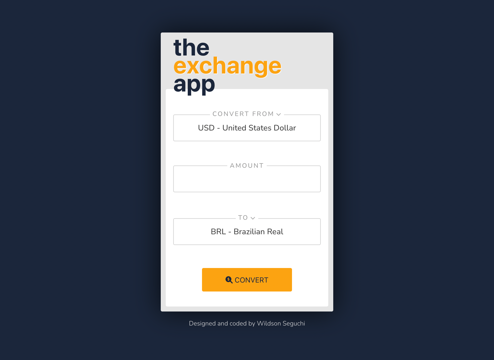

# Exchange App

## Welcome / Bem vindo!

Thanks for checking out my front-end project. 
🇧🇷/🇵🇹 _Obrigado por conferir meu projeto de front-end._

## Overview

A straightforward currency exchange rate app built with React JS. 
_Um aplicativo para a conversão de taxas de câmbio construído em React JS_

## Built with

- React JS;
- Mobile-first workflow;
- [Exchange Rate API](https://www.exchangerate-api.com/);

## Features

- Supports 161 currencies.
- Responsive design.

## Links

- App URL (Deploy): [https://wseguchi.github.io/exchange-rate-app/](https://wseguchi.github.io/exchange-rate-app/)
- Github Repository: [https://github.com/wseguchi/exchange-rate-app](https://github.com/wseguchi/exchange-rate-app)

## Author

- Wildson Seguchi
- [Github](https://github.com/wseguchi)
- [LinkedIn](https://www.linkedin.com/in/wildson-seguchi/)
